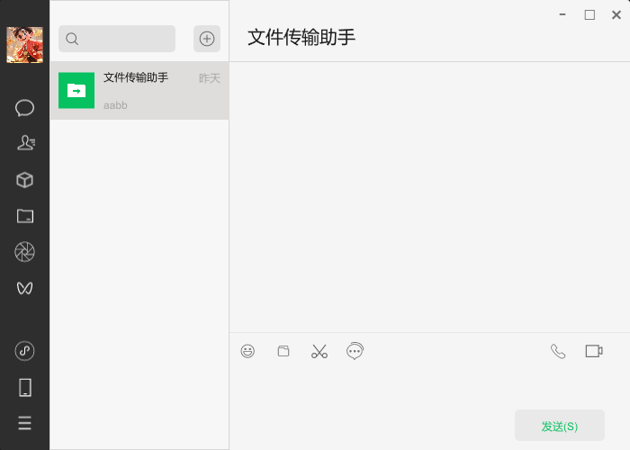

# MeChat

**MeChat** 是一个使用 Rust 和 [Slint](https://slint-ui.com/) 框架开发的微信风格 UI 界面。该项目致力于模仿微信的用户界面设计，并为学习 Rust 和 Slint 提供实际开发练习。

## 项目简介

MeChat 是一个简洁的聊天 UI 项目，重点模拟了微信的基础界面布局。它展示了使用 Rust 进行 UI 开发的能力，并通过 Slint 实现了现代化、响应式的用户界面，适合移动端与桌面端应用开发。

## 功能特色

- 模仿微信的主界面布局，包括聊天列表、联系人和个人中心等模块。
- 使用 Slint 框架，提供高效的 UI 渲染与动画支持。
- 支持跨平台开发：可以在 Windows、macOS 和 Linux 上运行。
- 基于 Rust 开发，具备高性能和安全性。

## 环境要求

- **Slint**: 版本 `1.80` 或更高
- **Cargo**: Rust 的包管理工具

## 安装指南

1. 克隆本仓库：

   ```bash
   git clone https://github.com/sanyexieai/me_chat.git
   cd me_chat
   ```

2. 确保安装了 Rust 和 Cargo，如未安装可参考 [Rust 官方安装指南](https://www.rust-lang.org/tools/install) 。

3. 安装 Slint CLI 工具：

   ```bash
   cargo install slint-viewer
   ```

4. 运行项目：

   ```bash
   cargo run
   ```

5. 运行界面：

   
   
   内置用户 sanye/123456

## 使用 Slint 实现的微信风格 UI

项目中各组件采用 Slint 描述，UI 代码清晰易懂，方便修改和扩展。以下是主要 UI 组件：

- **ChatList**: 聊天列表，显示对话的概览
- **ContactList**: 联系人列表，展示好友信息
- **Profile**: 个人中心，显示用户个人信息和设置

## 贡献

欢迎对本项目提出建议和贡献代码，您可以：

- 提交 issues 报告错误或提供建议
- 提交 pull requests 增强功能或修复问题

## 许可协议

本项目采用 MIT 许可证。详细信息请参阅 [LICENSE](LICENSE) 文件。
